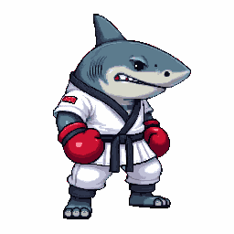

<div align="center">

# 🎮 Pixelator

### A self-contained pixel-art studio — **Generate · Pixelate · Animate · Voxelize · Tiles**

*Give it one sprite → get a clean, **grounded**, transparent sprite-sheet animation.*

<p>
  
  
  
  
  
  
</p>

<br>



**A 256px shark boxer — generated, then animated.** Feet grounded · clean-transparent · looping.

<br>

<table>
  <tr>
    <td align="center"></td>
    <td align="center"></td>
    <td align="center"></td>
    <td align="center"></td>
  </tr>
  <tr>
    <td align="center"><sub><b>⚔️ Attack</b></sub></td>
    <td align="center"><sub><b>🚶 Walk</b></sub></td>
    <td align="center"><sub><b>🤸 Backflip</b></sub></td>
    <td align="center"><sub><b>🧭 Top-down · RPG</b></sub></td>
  </tr>
</table>

<sub>Every frame above is real Retro Diffusion output from a single generated character.</sub>

</div>

---

## ✨ What it does

|  | Tool | |
|:---:|---|---|
| 🎨 | **Generate** | Prompt → RD sprite → pixel-snapped, transparent. Side / **Isometric** / Top-down views. |
| 🖼️ | **Pixelate** | Any image → clean pixel art (downsample · median-cut palette · corner-key alpha). |
| 🎬 | **Animate** | One sprite → prep (crop/colors/flip/position) → RD sprite-sheet → **grounded, looping** playback + GIF/sheet export. |
| 🧊 | **Voxelize** | 2D sprite → extruded 3D voxel model (Three.js) → OBJ export. |
| 🧱 | **Tiles** | Seamless tileable textures (`tile_x` / `tile_y`). |
| 💾 | **My Assets** | Everything auto-saves to IndexedDB; animations **loop as live thumbnails** and replay in the player. |

---

## 🎬 Animate — the core

```
sprite ─▶ auto-prep (snap · crop · palette · flip · position)
       ─▶ rd_advanced_animation__<action> + input_image + frames_duration
       ─▶ sprite sheet (RD returns a GRID — e.g. 4×2 for 8 frames)
       ─▶ slice · FEET-GROUND · re-composite
       ─▶ looping playback (Play / Pause / Replay) + GIF / sheet export
```

> **Feet grounding is the whole game.** Each frame's lowest opaque row is locked to a shared baseline and the body is horizontally anchored, so the character stays planted instead of sliding or bobbing. Measured on the real walk cycle: **feet within a 2px band across all 8 frames**, horizontal drift **0.4px**. Airborne actions (jump / backflip) auto-disable grounding so the arc survives.

**Actions** — `attack · walking · idle · jump · crouch · destroy · custom_action · subtle_motion`
**Frames** — 4 · 6 · 8 · 10 · 12 · 16 &nbsp;·&nbsp; **Sizes** — 64 · 128 · 192 · 256

<details>
<summary><b>🎞️ Frame-by-frame breakdowns (real RD, 8 frames each)</b></summary>

<br>

**Attack** — `attack, shark in martial arts uniform with red gloves, looping animation`


**Walk** — `walking animation, smooth confident steps, looping animation`


**Backflip** — `custom_action`: `does a backflip: crouches, springs up, tucks knees to chest, full backward rotation in mid-air, lands on both feet`


</details>

### 🧭 Top-down 4-direction walk (RPG)

A different RD family — `rd_animation__four_angle_walking`: **prompt-driven** (no input sprite), returns a **4×4 grid = 16 frames** (4 facings ↓ ← → ↑ × 4 walk frames). Toggle it in Animate; the player previews one direction at a time.

<div align="center">
  
  &nbsp;&nbsp;&nbsp;
  
</div>

---

## 🚀 Quick start

```bash
npm install
npm run dev
```

| | |
|---|---|
| 🖥️ **Studio UI** | http://localhost:5178 |
| 🔌 **Proxy** | http://localhost:8787 — holds the RD key, exposes the job API the SPA polls |

**No key needed to try it** — with no `RETRO_DIFFUSION_API_KEY` the proxy runs in **MOCK mode** (procedural sprites + fake sheets) so the whole studio works offline.

<details>
<summary><b>🔑 Go live with Retro Diffusion</b></summary>

<br>

```bash
cp .env.example .env
# put your key in .env:  RETRO_DIFFUSION_API_KEY=rdpk-...
npm run dev
```

The status bar shows `LIVE · RD · $balance` when the key is set.

</details>

---

## 🧠 Retro Diffusion prompting — what we learned

<details>
<summary><b>The rules that make animations come out right</b> (from the RD API guide + real testing)</summary>

<br>

- **Advanced animations describe MOTION, not the character.** Identity comes from `input_image` — don't re-describe hair/armor/colors, it fights the image. Pixelator auto-fills a proven motion prompt per action; `looping animation` makes the cycle seamless.
- **A neutral, side-profile, full-body start frame gives the best results.** Mid-action start frames extrapolate poorly.
- **Weight/speed adverbs are the #1 quality lever** — *"slow, heavy steps" · "quick, light" · "confident, steady"*.
- **`custom_action` takes a kinematic sentence** — describe the arc phase by phase (crouch → spring → tuck → rotate → land).
- **Sheets come back as a GRID, not a strip.** Verified: 6f = 3×2 · 8f = 4×2 · 16f = 4×4 — tight, no padding. Auto-detect frame width (`cols = round(sheetW / frameW)`); don't hardcode a layout.
- **Frame resolution follows the INPUT sprite, not the `width` param.** Generate the source at 256px for crisp 256px frames — a 64px source "animated at 256" still yields 64px frames. Generate → Animate at the same size for high-res.
- **`remove_bg: true`** yields hard 1-bit alpha — clean, aliased pixel edges and reliably transparent frames.
- **RD is slow + async, and time is server-load-bound** (not size/frames): submit `async:true` → poll `tasks/{id}`; result nests under `task.result`. Never re-submit a lost job (it re-charges).
- **Isometric is STATIC only.** `rd_plus__isometric` / `rd_plus__topdown_map` make iso/top-down stills; RD's animation engine is side-view. Animated top-down = `four_angle_walking`.

</details>

---

## 🏗️ Architecture

<details>
<summary><b>How the pieces fit</b></summary>

<br>

```
server/index.mjs        Node/Express proxy → Retro Diffusion direct API (async submit + poll, retry, MOCK fallback)
src/lib/pixelSnap.ts    the snap engine (downsample · median-cut quantize · corner-key alpha)
src/lib/frames.ts       frame prep + FEET-grounding stabilization + palette remap + sheet composite
src/lib/gif.ts          animated-GIF export (gifenc, transparent-aware)
src/lib/api.ts          client: start job + poll (resilient to proxy restarts)
src/pages/              Home · Generate · Pixelate · Animate · Voxelize · Tiles · Library
src/store.ts            Zustand store (tab, Generate→Animate handoff, replay-from-library)
tools/pixel-snap.html   standalone Pixel Snap tool
```

**Stack** — Vite · React · TypeScript · Zustand · Three.js (voxelize) · gifenc (GIF) · IndexedDB (assets).

</details>

---

## ✅ Status

**Working & verified end-to-end (real RD):**

- 🎨 Generate — with Side / Isometric / Top-down views
- 🎬 Animate — attack · walk · backflip · **top-down 4-direction walk**, feet-grounded where it applies, transparent
- 🖼️ Pixelate · 🧊 Voxelize (+ OBJ) · 🧱 Tiles
- 💾 My Assets — looping thumbnails + one-click replay
- ⬇️ GIF / sheet export · ⏱️ live countdown timer

**Next:** true isometric *animation* (needs a side engine — RD is static-only) · auto-seed the motion prompt from the source · `8_dir_rotation` facings. See [issues](../../issues).
