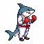
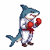
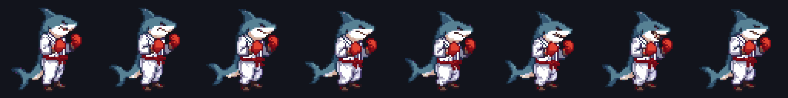
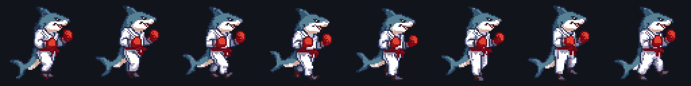
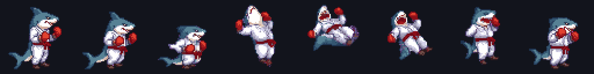
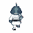
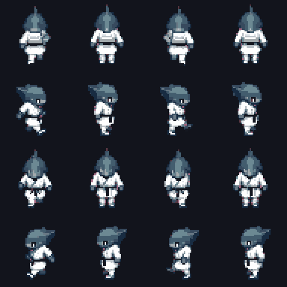

# Pixelator

A self-contained **pixel-art studio** — Generate · Pixelate · **Animate** · Voxelize · Tiles. Internal tool, one AI provider: **Retro Diffusion** (direct API).

Give it one sprite → get a clean, **grounded**, transparent sprite-sheet animation.

<p align="center">
   &nbsp;
   &nbsp;
  
</p>
<p align="center"><em>Real Retro Diffusion output — one generated shark boxer, animated three ways. Attack · Walk · Backflip.</em></p>

---

## What it does

| Tool | What it does |
|---|---|
| **Generate** | prompt → Retro Diffusion sprite → pixel-snapped, transparent. Side / **Isometric** / Top-down views. |
| **Pixelate** | any image → clean pixel art (downsample · median-cut palette · corner-key alpha). |
| **Animate** | one sprite → prep (crop/colors/flip/position) → RD sprite-sheet → **grounded, looping** playback + GIF/sheet export. |
| **Voxelize** | 2D sprite → extruded 3D voxel model (Three.js) → OBJ export. |
| **Tiles** | seamless tileable textures (`tile_x`/`tile_y`). |
| **My Assets** | everything auto-saves to IndexedDB; animations **loop as live thumbnails** and replay in the player. |

---

## Animate — the core

```
sprite ─▶ auto-prep (snap · crop · palette · flip · position)
       ─▶ rd_advanced_animation__<action> + input_image + frames_duration
       ─▶ sprite sheet (RD returns a GRID, e.g. 4×2 for 8 frames)
       ─▶ slice · FEET-GROUND · re-composite
       ─▶ looping playback (Play/Pause/Replay) + GIF/sheet export
```

**Feet grounding is the whole game.** Each frame's lowest opaque row is locked to a shared baseline and the body is horizontally anchored, so the character stays planted instead of sliding/bobbing. Measured on the real walk cycle above: **feet stay within a 2px band across all 8 frames**, horizontal drift **0.4px**.

**Actions** (`rd_advanced_animation__*`): `attack · walking · idle · jump · crouch · destroy · custom_action · subtle_motion`.
**Frames:** 4 · 6 · 8 · 10 · 12 · 16. **Sizes:** 64 · 128 · 192 · 256.

### The animation frames (real RD, 8 frames each)

**Attack** — `attack, shark in martial arts uniform with red gloves, looping animation`


**Walk** — `walking animation, smooth confident steps, looping animation`


**Backflip** — `custom_action`: `does a backflip: crouches, springs up, tucks knees to chest, full backward rotation in mid-air, lands on both feet`


### Top-down 4-direction walk (RPG)

A different RD family — `rd_animation__four_angle_walking`: **prompt-driven** (no input sprite), returns a **4×4 grid = 16 frames** (4 facings ↓ ← → ↑ × 4 walk frames) at 48px. Toggle it in Animate; the player previews one direction at a time. Fast + cheap (~54s, $0.07).

<p align="center">
  
  &nbsp;&nbsp;
  
</p>

---

## Retro Diffusion prompting — what the API guide taught us

Distilled from the [RD API guide](https://retrodiffusion.ai/app/guide/api), the [RD api-examples](https://github.com/Retro-Diffusion/api-examples), and our own testing:

- **Advanced animations describe MOTION, not the character.** Identity comes from `input_image` — don't re-describe hair/armor/colors, it fights the image. Pixelator auto-fills a proven motion prompt per action; `looping animation` makes the cycle seamless.
- **A neutral, side-profile, full-body start frame gives the best results.** Mid-action start frames extrapolate poorly.
- **Weight/speed adverbs are the #1 quality lever** — "slow, heavy steps" / "quick, light" / "confident, steady".
- **`custom_action` takes a kinematic sentence** — describe the arc phase by phase (crouch → spring → tuck → rotate → land).
- **Sheets come back as a GRID, not a strip** (8f @ 64px = 256×128 = 4×2). Auto-detect frame width (`cols = round(sheetW / frameW)`); don't hardcode a layout.
- **`remove_bg: true`** yields hard 1-bit alpha — clean, aliased pixel edges and reliably transparent frames (better grounding).
- **RD is slow + async.** Submit `async:true` → poll `tasks/{id}`; result nests under `task.result`. Measured: 64px/8f ≈ 210–250s. Never re-submit a lost job (it re-charges).
- **Isometric is STATIC only.** `rd_plus__isometric` / `rd_plus__topdown_map` make iso/top-down stills; RD's animation engine is side-view only. For animated top-down there's `rd_animation__four_angle_walking` (48px, 4×4, 16f) and `rd_animation__8_dir_rotation` (turntable, not a walk).

---

## Run

```bash
npm install
npm run dev
```

- Studio UI → http://localhost:5178
- Node proxy → http://localhost:8787 (holds the RD key, exposes the job API the SPA polls)

**No key needed to try it** — with no `RETRO_DIFFUSION_API_KEY` the proxy runs in **MOCK mode** (procedural sprites + fake sheets) so the whole studio works offline.

### Go live

```bash
cp .env.example .env
# put your key in .env:  RETRO_DIFFUSION_API_KEY=rdpk-...
npm run dev
```

Status bar shows `LIVE · RD · $balance` when the key is set.

---

## Architecture

```
server/index.mjs        Node/Express proxy → Retro Diffusion direct API (async submit + poll, retry, MOCK fallback)
src/lib/pixelSnap.ts    the snap engine (downsample · median-cut quantize · corner-key alpha)
src/lib/frames.ts       frame prep + FEET-grounding stabilization + palette remap + sheet composite
src/lib/gif.ts          animated-GIF export (gifenc, transparent-aware)
src/lib/api.ts          client: start job + poll (resilient to proxy restarts)
src/pages/              Home · Generate · Pixelate · Animate · Voxelize · Tiles · Library
src/store.ts            Zustand store (tab, Generate→Animate handoff, replay-from-library)
tools/pixel-snap.html   standalone Pixel Snap tool (also published as an Artifact)
```

Stack: Vite + React + TypeScript SPA · thin Node/Express proxy · Zustand · Three.js (voxelize) · gifenc (GIF) · IndexedDB (assets).

---

## Status

**Working & verified end-to-end (real RD):** Generate (+ iso/top-down views), Pixelate, Animate (attack/walk/backflip + **top-down 4-direction walk**, feet-grounded where it applies, transparent), Voxelize (+ OBJ), Tiles, My Assets (looping thumbnails + replay), GIF/sheet export, countdown timer.

**Next:** auto-seed the motion prompt from the source, per-size timing calibration, `8_dir_rotation` facings. See [issues](../../issues).
